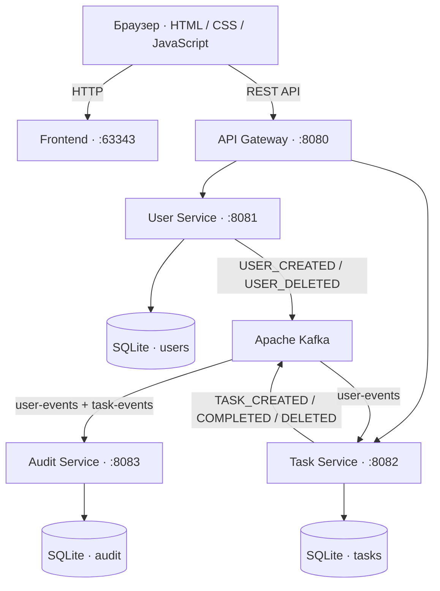

<div align="center">

# WebSiteMicroservices

**Микросервисное веб-приложение для управления задачами сотрудников**

Регистрация и вход · Кабинет администратора · Задачи сотрудников · События Apache Kafka · Аудит действий

`Java 25` · `Spring Boot 4.1.1` · `Spring Cloud Gateway` · `Apache Kafka 4.0.1` · `SQLite` · `Docker Compose`

[Возможности](#возможности) · [Архитектура](#архитектура) · [Быстрый старт](#быстрый-старт) · [api](#rest-api) · [События](#событийная-модель)

</div>

---

## О проекте

WebSiteMicroservices — система постановки и выполнения рабочих задач с разделением на независимые сервисы. Администратор управляет сотрудниками и назначает им задачи; сотрудники просматривают свои задачи и отмечают выполненные. Изменения пользователей и задач передаются через **Apache Kafka**, а отдельный сервис сохраняет историю событий.

Интерфейс написан на HTML, CSS и JavaScript без тяжёлого фронтенд-фреймворка. HTTP-запросы проходят через единый API Gateway; каждый бизнес-сервис работает со своей базой SQLite.

## Возможности

| Администратор | Сотрудник |
| --- | --- |
| Просмотр списка сотрудников | Регистрация и вход в аккаунт |
| Создание задач для выбранного сотрудника | Просмотр активных задач |
| Просмотр всех задач сотрудника и их статусов | Просмотр истории выполненных задач |
| Удаление сотрудника | Отметка задачи как выполненной |

**Дополнительно:** публикация событий о пользователях и задачах в Kafka, сохранение истории событий в Audit Service, контейнеризированный запуск через Docker Compose.

## Архитектура



> Порты `8081`, `8082` и `8083` относятся к внутренним сервисам. В конфигурации Docker Compose наружу опубликованы интерфейс (`63343`) и Gateway (`8080`); к API из браузера обращаются через Gateway.

### Сервисы

| Компонент | Назначение | Технологии |
| --- | --- | --- |
| **Frontend** | Страницы входа, регистрации и кабинеты двух ролей | HTML, CSS, JavaScript, `http-server` |
| **API Gateway** | Единая точка входа и маршрутизация запросов | Spring Cloud Gateway (WebFlux) |
| **User Service** | Пользователи, регистрация, вход, список сотрудников | Spring Boot, Spring Data JPA, BCrypt, SQLite |
| **Task Service** | Создание, просмотр, выполнение и удаление задач | Spring Boot, Spring Data JPA, SQLite, Kafka |
| **Audit Service** | Получение и сохранение событий пользователей и задач | Spring Boot, Kafka, SQLite |
| **Kafka** | Асинхронная передача событий между сервисами | Apache Kafka, KRaft |

## Технологический стек

- **Backend:** Java 25, Spring Boot 4.1.1, Spring Cloud Gateway, Spring Data JPA, Spring for Apache Kafka.
- **Хранение данных:** SQLite и Hibernate (SQLite dialect); собственная база у каждого сервиса.
- **Пароли:** BCrypt через `PasswordEncoder`.
- **Frontend:** HTML5, CSS3, JavaScript, `http-server`.
- **Сборка и запуск:** Maven Wrapper, многоступенчатые Dockerfile, Docker Compose.

## Быстрый старт

### Что потребуется

- [Docker](https://docs.docker.com/get-docker/) с поддержкой `docker compose`.
- Свободные порты **63343** и **8080**.

Для запуска всей системы **не требуется устанавливать Java, Maven или Node.js на компьютер** — Docker собирает и запускает компоненты в контейнерах.

### 1. Получить проект

Клонируйте репозиторий или распакуйте архив, затем перейдите в папку с `docker-compose.yml`:

```bash
cd WebSiteMicroservices
```

### 2. Запустить сервисы

```bash
docker compose up --build -d
```

При первом запуске Docker скачает базовые образы и соберёт Java-сервисы. Kafka должна пройти healthcheck, прежде чем стартуют зависящие от неё сервисы.

### 3. Открыть приложение

**[http://localhost:63343](http://localhost:63343)** — веб-интерфейс приложения. REST API доступен по адресу **[http://localhost:8080](http://localhost:8080)**.

Зарегистрируйте аккаунт сотрудника через интерфейс. Учётная запись администратора создаётся при запуске User Service из параметров `admin.email` и `admin.password` в его конфигурации; используйте значения, заданные в **вашем** окружении.

### Управление контейнерами

```bash
# Состояние сервисов
docker compose ps

# Логи всех сервисов
docker compose logs -f

# Логи конкретного сервиса
docker compose logs -f task-service

# Остановка приложения
docker compose down
```

## Как пользоваться

1. **Регистрация:** создайте аккаунт сотрудника на странице регистрации.
2. **Вход:** откройте главную страницу и войдите под своей учётной записью.
3. **Администратор:** выберите сотрудника, укажите описание задачи и отправьте её. В кабинете также доступен просмотр задач и управление сотрудниками.
4. **Сотрудник:** откройте активные задачи, выберите нужную и отметьте её выполненной. Выполненные задачи отображаются на отдельной вкладке.

## REST API

Все пути ниже указаны **относительно Gateway** `http://localhost:8080`. Gateway направляет `/api/users/**` в User Service, а `/api/tasks/**` — в Task Service.

### Пользователи

| Метод | Путь | Назначение |
| --- | --- | --- |
| `POST` | `/api/users/register` | Регистрация пользователя |
| `POST` | `/api/users/login` | Вход и получение роли (`ADMIN` / `USER`) |
| `GET` | `/api/users/workers` | Список email сотрудников |
| `DELETE` | `/api/users` | Удаление пользователя |

Пример регистрации:

```bash
curl -X POST http://localhost:8080/api/users/register \
  -H "Content-Type: application/json" \
  -d '{"email":"employee@example.com","password":"example-password"}'
```

### Задачи

| Метод | Путь | Назначение |
| --- | --- | --- |
| `GET` | `/api/tasks?email=...` | Активные задачи сотрудника |
| `GET` | `/api/tasks/completed?email=...` | Выполненные задачи сотрудника |
| `GET` | `/api/tasks/admin?email=...` | Все задачи выбранного сотрудника |
| `POST` | `/api/tasks` | Создать задачу |
| `PUT` | `/api/tasks/{id}/complete` | Отметить задачу выполненной |
| `DELETE` | `/api/tasks/{id}` | Удалить задачу |

Пример создания задачи:

```bash
curl -X POST http://localhost:8080/api/tasks \
  -H "Content-Type: application/json" \
  -d '{"email":"employee@example.com","text":"Подготовить отчёт"}'
```

Пример завершения задачи с ID `1`:

```bash
curl -X PUT http://localhost:8080/api/tasks/1/complete
```

Статусы задач: `ACTIVE` (активная) и `COMPLETED` (выполненная).

## Событийная модель

Сервисы обмениваются событиями асинхронно через Kafka. User Service публикует события в `user-events`, Task Service — в `task-events`. Audit Service читает **оба** топика и сохраняет их в собственной базе.

| Топик | События | Отправитель | Получатели |
| --- | --- | --- | --- |
| `user-events` | `USER_CREATED`, `USER_DELETED` | User Service | Task Service, Audit Service |
| `task-events` | `TASK_CREATED`, `TASK_COMPLETED`, `TASK_DELETED` | Task Service | Audit Service |

При удалении пользователя Task Service получает `USER_DELETED` и обрабатывает удаление связанных задач. Обработка происходит **асинхронно**: операция в User Service и реакция Task Service не являются одним HTTP-запросом.

Пример события пользователя (значения для иллюстрации):

```json
{
  "eventId": "b7f9d690-5304-4cb2-a2af-fd8c5e40ea17",
  "eventType": "USER_DELETED",
  "entityType": "USER",
  "entityId": "employee@example.com",
  "email": "employee@example.com",
  "timestamp": "2026-09-16T12:00:00Z"
}
```

`eventId` идентифицирует событие; Audit Service использует его, чтобы не сохранять одно и то же событие повторно.

### Посмотреть события в Kafka

```bash
# Список топиков
docker compose exec kafka /opt/kafka/bin/kafka-topics.sh \
  --bootstrap-server localhost:9092 --list

# События пользователей
docker compose exec kafka /opt/kafka/bin/kafka-console-consumer.sh \
  --bootstrap-server localhost:9092 \
  --topic user-events --from-beginning

# События задач
docker compose exec kafka /opt/kafka/bin/kafka-console-consumer.sh \
  --bootstrap-server localhost:9092 \
  --topic task-events --from-beginning
```

Для прекращения просмотра нажмите `Ctrl+C`.

## Структура проекта

```text
WebSiteMicroservices/
├── docker-compose.yml
├── frontend/
│   ├── index.html                 # Страница входа
│   ├── registration.html          # Регистрация
│   ├── admin.html                 # Кабинет администратора
│   ├── worker.html                # Кабинет сотрудника
│   ├── scripts/                   # Работа с API и логика интерфейса
│   ├── styles/                    # Стили страниц
│   └── Dockerfile
├── gateway/
│   ├── pom.xml
│   ├── src/main/resources/application.yml
│   └── Dockerfile
└── services/
    ├── user-service/
    ├── task-service/
    └── audit-service/
```

В каждом Java-сервисе находятся собственные `pom.xml`, `Dockerfile`, исходники в `src/main/java` и настройки в `src/main/resources`.

## Локальная разработка

Для запуска Java-сервисов **без Docker** нужны JDK 25, Maven Wrapper из соответствующего каталога и доступный Kafka-брокер. В таком режиме адреса зависимостей берутся из `application.properties` / `application.yml` и при необходимости переопределяются переменными окружения.

Пример запуска одного сервиса:

```bash
cd services/user-service
./mvnw spring-boot:run
```

В Windows используйте `mvnw.cmd spring-boot:run`. Остальные Java-сервисы запускаются из своих каталогов аналогично. Для фронтенда нужен Node.js и доступная команда `http-server`; контейнерный запуск через Compose проще, поскольку поднимает всю систему сразу.

---

<div align="center">

**WebSiteMicroservices** · REST для пользовательских запросов, Kafka для межсервисных событий.

</div>
